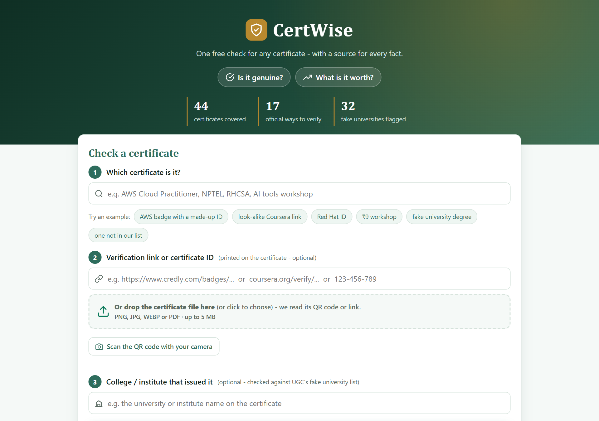
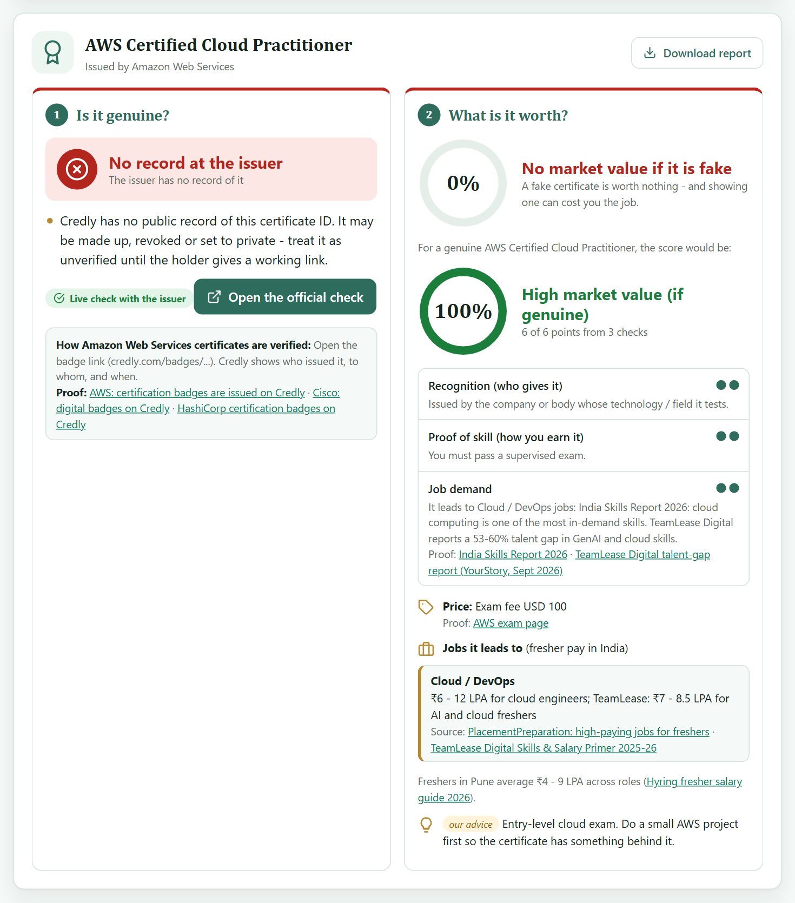
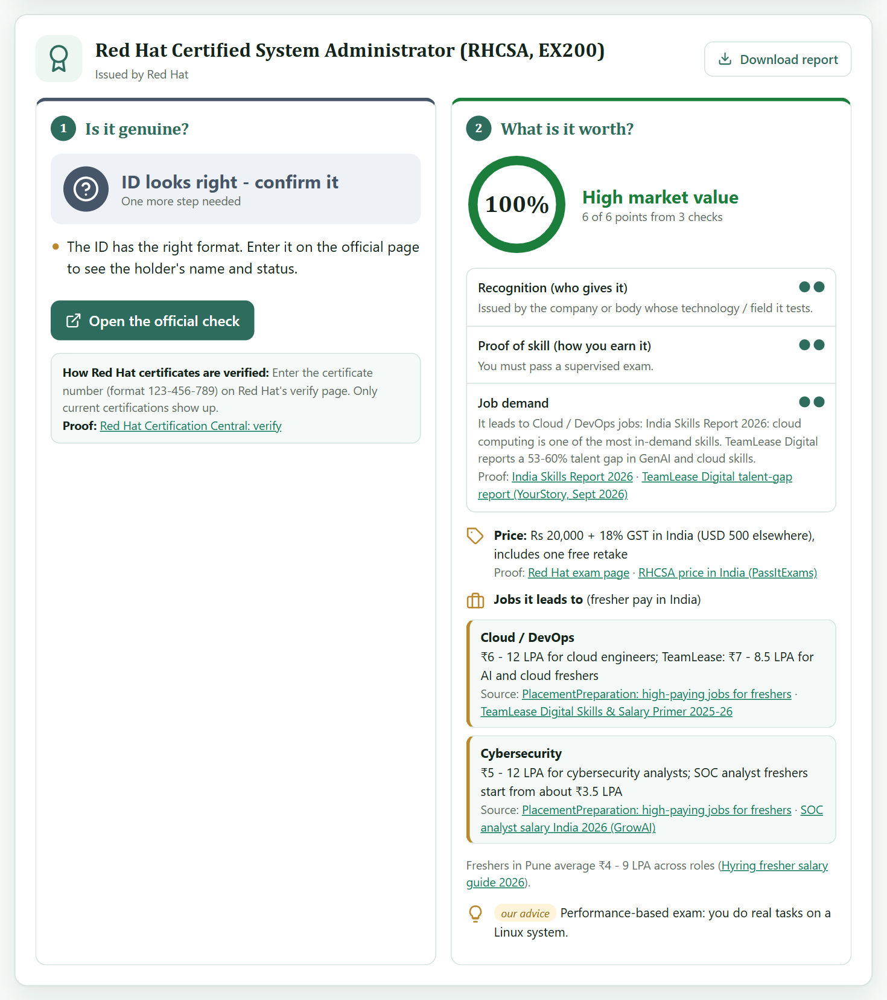
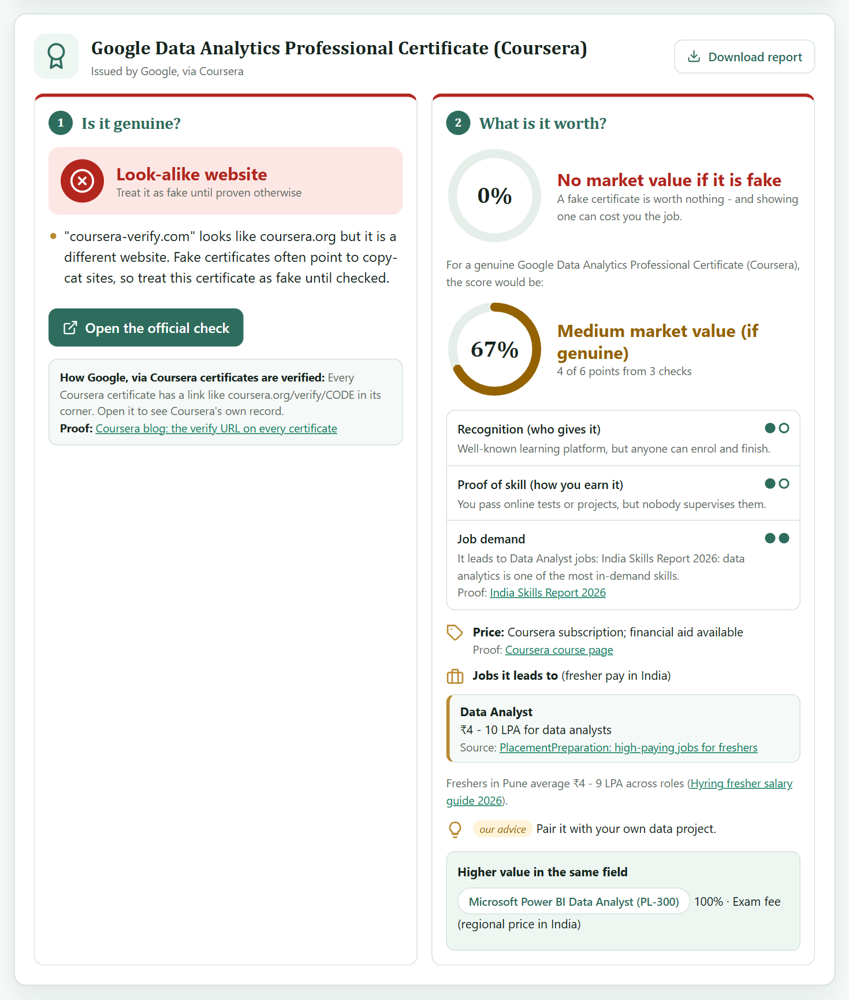
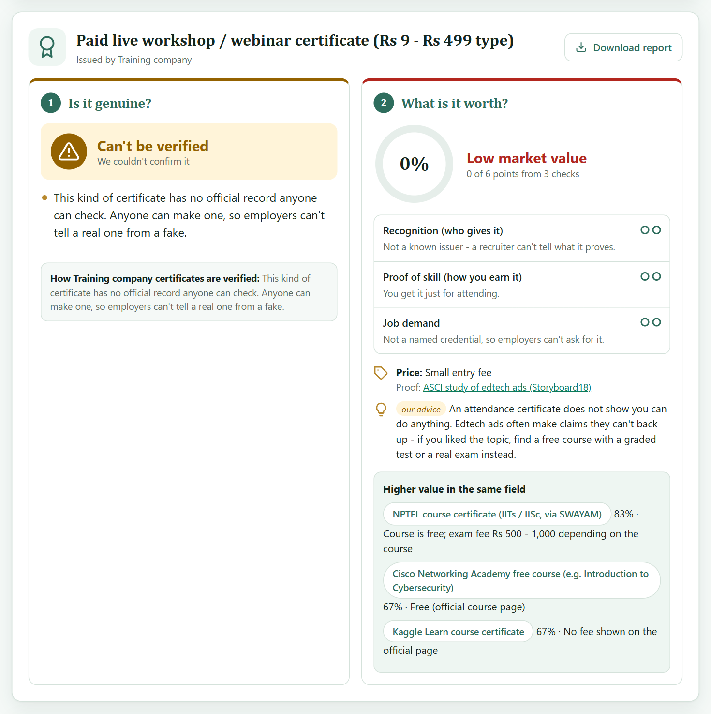
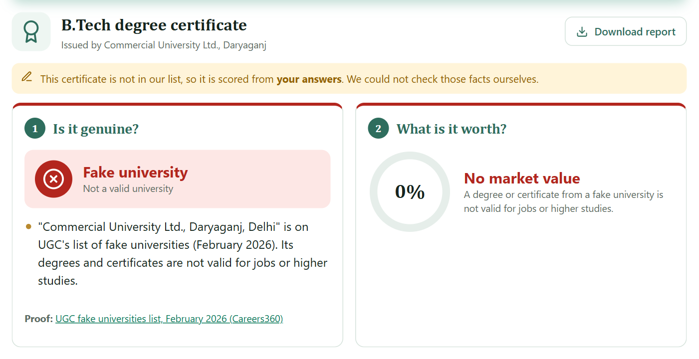
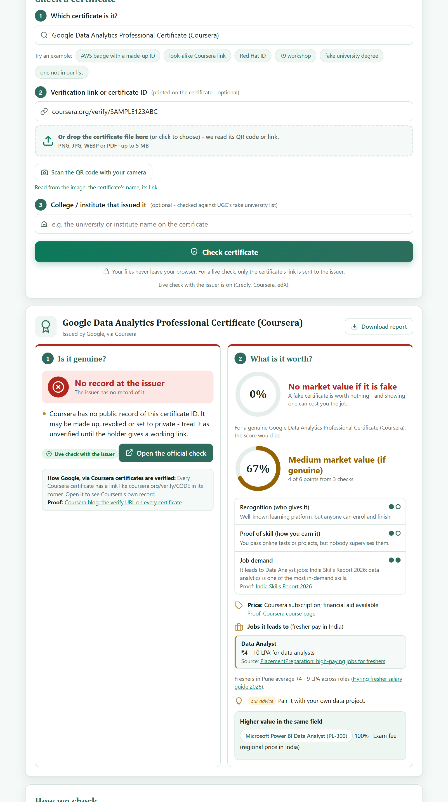
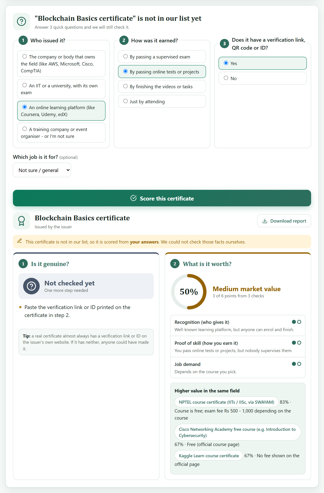
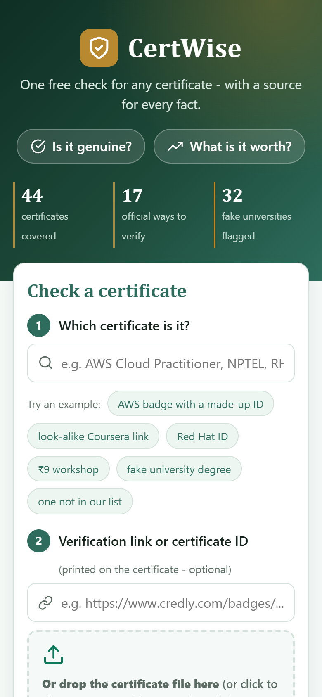

# CertWise — is this certificate genuine, and what is it worth?

[](https://github.com/Purva9665/certwise-ctrlfreaks/actions/workflows/ci.yml)

**She Solves 3.0 · Round 2 prototype · Team Ctrl Freaks**
Track: Web & Software Development · Domain: Education

**Live demo:** https://purva9665.github.io/certwise-ctrlfreaks/
(The online demo runs everything except the *live check with the issuer*, which needs the small server in this
repository. Run `npm start` to see the full prototype — it takes one command and no installed packages.)



## Contents

1. [Problem Statement](#problem-statement)
2. [Proposed Solution](#proposed-solution)
3. [Features](#features)
4. [Technologies / Tech Stack Used](#technologies--tech-stack-used)
5. [Installation & Setup Instructions](#installation--setup-instructions)
6. [How to Run the Project](#how-to-run-the-project)
7. [Project Structure](#project-structure)
8. [Screenshots](#screenshots)
9. [Team Members](#team-members)
10. [Future Scope / Enhancements](#future-scope--enhancements)
11. [How the checks work](#how-the-checks-work)
12. [How the data stays current and honest](#how-the-data-stays-current-and-honest)
13. [Demo script](#demo-script-about-3-minutes)
14. [Questions and answers](#questions-and-answers)
15. [References](#references)

---

## Problem Statement

> **Students can't easily check whether a certificate is genuine, or what it is worth in the job market.**

Students collect certificates because they believe certificates lead to jobs: 96% of Indian students believe a
professional certificate will help them land one [1], and 1 in 3 Indian students has already earned a
micro-credential [2]. But two questions are hard to answer for any single certificate:

**1. Is it genuine?**

- Fakes are real and large in number. UGC's official list has 32 fake universities (February 2026) [3]. In one
  racket alone, police recovered over one lakh counterfeit certificates [4]. A background-verification company
  found that 5% of its education checks flagged fake certificates or degrees from blacklisted institutions [5].
- Every issuer verifies in its own way — a Credly badge link, a `coursera.org/verify` code, an NPTEL QR code, a
  Red Hat certificate ID — so there is no single place to check.
- Copy-cat links such as `coursera-verify.com` look official to someone in a hurry.

**2. What is it worth?**

- A genuine certificate can still be worth very little. Employers do not value all certificates equally: 93% of
  Indian employers prefer candidates with credit-bearing credentials over those without [2], and hiring managers
  rank some certificates far above others [6].
- Students are also sold certificates with nothing behind them: some companies exist only to issue internship
  certificates for a price [7].

**What exists today:** DigiLocker's National Academic Depository verifies academic awards lodged by institutions
[8]; Credly verifies its own badges; the Smart India Hackathon 2025 statement SIH25029 ("Authenticity Validator
for Academia") asks for a checker of academic certificates [9]. Each answers only the first question, and only
for some certificates. We found nothing that gives an Indian student both answers for any certificate.

## Proposed Solution

**CertWise** is one free check that gives two answers for any certificate, with a source for every fact.

| | Answer | How we get it |
|---|---|---|
| **1** | **Is it genuine?** | We check the certificate's link or ID against the issuer's *official* way of verifying (17 methods, each with a proof link), catch look-alike websites, check the college against UGC's fake university list, and — for Credly, Coursera and edX — **ask the issuer itself** whether the certificate exists. |
| **2** | **What is it worth?** | A market value score from three checks: who recognises it, how it is earned, and whether its jobs are in demand. We also show the price, the fresher salary of the jobs it leads to, and higher-value certificates in the same field. |

What makes it different:

- **Both answers in one place.** A fake certificate always scores 0%; a genuine ₹9 workshop certificate is
  marked genuine-but-low-value, so students see the difference.
- **Uses each issuer's own verification.** No blockchain and no partnership needed, so it works today for
  certificates that students already hold.
- **Honest about its limits.** It never says "100% genuine". When it cannot verify something, it says so and
  sends the student to the issuer's own page, where the holder's name is shown.
- **Every fact has a source.** Prices, salaries and demand come from pages we link to, and an automated check
  keeps a fact only if its exact words are on the page.

## Features

**Is it genuine?**

- Checks a verification link, QR code or certificate ID against 17 official verification methods (Credly,
  Coursera, NPTEL, Red Hat, CompTIA, Microsoft Learn, Google Cloud, Udemy, edX, Internshala and more).
- **Live check with the issuer** for Credly, Coursera and edX: *Confirmed by the issuer*, *No record at the
  issuer*, *Real, but a different certificate*, or *Confirmed, but expired*.
- Finds **look-alike websites** (`coursera-verify.com`, `credlly.com`) using edit distance.
- Checks the college name against **UGC's list of 32 fake universities**, even with spelling differences.
- Says plainly when a certificate **can't be verified** (a workshop or participation certificate with no record).

**What is it worth?**

- **Market value score** (High / Medium / Low) from three checks, each explained on the page.
- Price, the jobs the certificate leads to, fresher salary and demand — each with a source link.
- Up to three **higher-value certificates** in the same field.
- Warnings, for example when an exam has closed or needs work experience.

**Getting the details off a certificate**

- **Upload** a PNG, JPG, WEBP or PDF (up to 5 MB): the QR code or link is read automatically.
- **Text reader (OCR)** for certificates with no QR code: finds the certificate's name, link, ID and college.
- **Camera scan** of the QR code on a phone.
- Files are read inside the browser and are **never uploaded**.

**Also**

- **44 certificates** with checked facts, plus a **3-question check for any certificate not in the list**.
- **Downloadable PDF report** of every result, with clickable proof links.
- Typo-tolerant search ("aws cloud practitoner" still works).
- Works on phones; no login and no cost.
- 149 automated tests, run on every push.

## Technologies / Tech Stack Used

| Layer | Technology | What it does here |
|---|---|---|
| Frontend | HTML5, CSS3, JavaScript (no framework, no build step) | The page, the form and the result |
| QR codes | [jsQR](https://github.com/cozmo/jsQR) 1.4.0 | Reads the QR code in an image, a PDF page or a camera frame |
| PDF reading | [pdf.js](https://mozilla.github.io/pdf.js/) 3.11.174 | Reads links and text inside an uploaded PDF |
| Text reader | [Tesseract.js](https://tesseract.projectnaptha.com/) 5 | OCR for images and scanned PDFs that have no QR code |
| PDF report | [jsPDF](https://github.com/parallax/jsPDF) 2.5.1 | Writes the downloadable report |
| Browser APIs | File API, Canvas, `getUserMedia` | Upload, image handling and the camera scanner |
| Backend | Node.js (built-in `http` module, no framework) | Serves the page and the small API (`/api/health`, `/api/live`) |
| Issuer records | Credly Open Badges 2.0 records; Coursera and edX certificate pages | The live check with the issuer |
| Core logic | Plain JavaScript in `logic.js` (edit distance, pattern matching, scoring) | The genuineness check and the market value score |
| Data | JavaScript data files | 44 certificates, 17 verification methods, job data and UGC's list, with proof links |
| Data refresh | Gemini API (free key), plus our own quote checker | Monthly update of prices, salaries and demand |
| Testing | A plain Node.js test file (no test framework) | 149 tests of the logic and the API |
| Automation | GitHub Actions | Runs the tests on every push; runs the monthly refresh |
| Hosting | GitHub Pages (page), Dockerfile (server) | ₹0 hosting for the page; a container file for the server |

The libraries are loaded from a CDN only when they are needed (for example, the text reader loads only when a
file has no QR code), so the first page load stays small.

## Installation & Setup Instructions

**You need**

- [Node.js](https://nodejs.org/) 18 or newer (we test on Node.js 22)
- [Git](https://git-scm.com/)
- A modern browser (Chrome, Edge or Firefox) and an internet connection (for the CDN libraries and the live check)

**Steps**

```bash
git clone https://github.com/Purva9665/certwise-ctrlfreaks.git
```

```bash
cd certwise-ctrlfreaks
```

That is all. The project uses only what comes with Node.js, so there is nothing to install.

## How to Run the Project

**Run the full prototype (page + live check)**

```bash
npm start
```

Then open http://localhost:5174 in your browser. To use another port, set the `PORT` environment variable.

**Run the tests**

```bash
npm test
```

149 tests should end with `ALL PASS`. The tests never contact the real issuer websites.

**Other ways**

- **Online:** https://purva9665.github.io/certwise-ctrlfreaks/ (no live check — a static host cannot run the server).
- **Without Node.js:** double-click `index.html`. Everything works except the live check and the camera, which
  need the server (or https).
- **In a container:** `docker build -t certwise .` then `docker run -p 5174:5174 certwise`. The Dockerfile is
  included but we have not been able to test it yet.

**Try these** (they are one-click examples on the page)

| Example | What you should see |
|---|---|
| AWS badge with a made-up ID | *No record at the issuer* — the link is on the real Credly site, but Credly has no such badge |
| Look-alike Coursera link | *Look-alike website* — treat it as fake; market value 0% |
| Red Hat ID | *ID looks right - confirm it*, and a *High market value* score |
| ₹9 workshop | *Can't be verified* and *Low market value*, with higher-value picks |
| Fake university degree | *Fake university*, with UGC's list as proof |
| One not in our list | Three questions, then a score marked "from your answers" |

To try the upload, drop `tests/sample_text_cert.png` (no QR code) or `tests/sample_qr.pdf` on the page. These are
made-up sample certificates.

## Project Structure

```
certwise-ctrlfreaks/
├── index.html              The page
├── style.css               The design
├── app.js                  Page behaviour: form, upload, camera, result, PDF report
├── logic.js                THE CORE: search, genuineness check, market value score
├── serve.js                The server: serves the page and the API
├── api/
│   └── live.js             Live check: asks Credly, Coursera or edX about a certificate
├── data/
│   ├── certs.js            44 certificates with checked facts and proof links
│   ├── verify.js           17 official verification methods + UGC's fake university list
│   ├── roles.js            Jobs: demand and fresher salary, each with a source
│   └── live.js             Facts written by the monthly refresh
├── refresh/
│   ├── refresh.mjs         Monthly refresh of prices, salaries and demand
│   ├── gemini.mjs          Talks to the Gemini API (free key)
│   ├── pages.js            Downloads the source pages
│   └── verify.js           Keeps a fact only if its exact quote is on the page
├── tests/
│   ├── test_logic.js       149 automated tests
│   └── sample_*            Made-up certificates for trying the upload
├── docs/
│   └── screenshots/        The images in this README
├── .github/workflows/
│   ├── ci.yml              Runs the tests on every push
│   └── refresh.yml         Runs the monthly refresh
├── Dockerfile              Container for the server
├── project-log.html        Everything we did, with the research and proof
├── package.json
└── README.md
```

## Screenshots

**1. Live check with the issuer** — the link is on the real Credly website, but Credly has no such badge, so a
made-up ID is caught. The right side shows what the certificate would be worth if it were genuine.



**2. Market value** — a score from three checks, then the price, the jobs it leads to and fresher salaries, each
with a source.



**3. Look-alike website** — a link that copies the issuer's name is treated as fake.



**4. Genuine is not the same as valuable** — a workshop certificate with no official record and no exam.



**5. Fake university** — the college is on UGC's list.



**6. Upload with the text reader** — a certificate image with no QR code: the name and link are read from the
picture and filled in.



**7. Any certificate, even one not in our list** — three questions, then a score that is clearly marked as based
on the student's answers.



**8. On a phone**



## Team Members

**Team Ctrl Freaks**

| Name | Role |
|---|---|
| Srushti Chaudhari | Team Leader |
| Sneha Ghule | Member |
| Purva Kadam | Member · [@Purva9665](https://github.com/Purva9665) |
| Tanishka Kadu | Member |

## Future Scope / Enhancements

- **Host the server online** so the live check with the issuer also works on the public website.
- **Live checks for more issuers**, adding each one only after confirming how its public records work.
- **Bulk and resume check** for placement cells: upload a resume or many certificates and get one table.
- **Browse and compare** all certificates in a field, sorted by market value.
- **Validity check:** show when a certificate expires and what must be renewed.
- **Signed credentials:** verify Open Badges 3.0 / W3C Verifiable Credentials signatures directly [10][11].
- **Hindi and Marathi** versions.
- **Monthly live data** on the page (prices, salaries, demand) once the refresh key is added.
- **More certificates**, starting with the ones students report through the "report a wrong fact" link.

---

## How the checks work

### 1. Is it genuine?

**First, in the browser** (`checkGenuine` in `logic.js`)

| What we check | Result |
|---|---|
| The issuer is on UGC's list of 32 fake universities (Feb 2026) | **Fake university** |
| The certificate type has no official record (workshop, participation, paid "internship") | **Can't be verified** |
| The link is on the issuer's official verification site (`credly.com/badges/...`, `coursera.org/verify/...`, `nptel.ac.in/noc/...`) | **Official verification link** |
| The link is on the official site but not a verification page | **Official site, but not a verification page** |
| The link copies the issuer's name or is a small typo of it (`coursera-verify.com`, `credlly.com`) | **Look-alike website** — treat as fake |
| Any other website | **Not the issuer's official site** |
| An ID in the right format (Red Hat `123-456-789`) | **ID looks right — confirm it** on the official page |

**Then, live with the issuer** (`api/live.js`, `applyLive` in `logic.js`)

When the link already looks official, the page asks our server, and the server asks the issuer itself:

| Issuer | What we ask | Real certificate | Made-up ID |
|---|---|---|---|
| Credly (AWS, Cisco, GitHub, Google Cloud, HashiCorp, Oracle...) | The badge's Open Badges record [12] | Badge name, issuer, issue date, expiry | 404 |
| Coursera (course certificates) | The certificate for that code | 200 | 404, "Certificate code could not be found" |
| edX | The certificate page | 200 | 404 |

If the issuer gives no clear answer, our result is left as it was — an unreadable answer never counts as
"confirmed". The last step is still the issuer's own page, where the holder's name is shown.

**Safety:** the server never fetches the link the user typed. It pulls out the ID, checks its format and builds
the issuer's address itself, so it cannot be pointed at another website. It allows 30 checks a minute per
address and logs only the issuer and the answer, never the link.

**Not in our list?** (`customCert`, `checkGenuineAny`) The student answers three questions — who issued it, how
it was earned, and whether it has a verification link or ID. The same score is worked out from those answers and
marked *scored from your answers — we could not check those facts ourselves*.

### 2. What is it worth? (`marketValue` in `logic.js`)

Three checks, 0–2 points each:

| Check | 2 | 1 | 0 |
|---|---|---|---|
| Recognition (who gives it) | Company or body that owns the field, or an IIT | Learning platform | Unknown training company |
| Proof of skill (how you earn it) | Supervised exam | Online tests or projects | Attendance, or only finishing the videos or tasks |
| Job demand | Two or more verified sources, or its jobs are "in demand" in cited reports | One source, or it depends on the course | Not a credential employers ask for |

Score = points ÷ 6. 70% or more is **High**, 45–69% is **Medium**, below 45% is **Low** market value. If the
genuineness check finds a fake, the market value is 0%.

## How the data stays current and honest

Every certificate fact in `data/` has a proof link. A monthly refresh (`refresh/refresh.mjs`, run by GitHub
Actions) updates prices, salaries and demand:

1. Our script downloads the trusted pages already listed in our data.
2. The Gemini API (free tier, `GEMINI_API_KEY`) copies out each fact as `{value, url, quote}`.
3. `refresh/verify.js` downloads the page itself and keeps the fact only if the quote is on the page and every
   number in the value is inside the quote.

The key is added as a repository secret (Settings → Secrets and variables → Actions), never in code. The refresh
has not been run yet, so the page currently shows the facts we checked by hand.

## Demo script (about 3 minutes)

With `npm start` running:

1. **AWS badge with a made-up ID** → *No record at the issuer*. Then paste a real public Credly badge link to see
   *Confirmed by the issuer* with its name and date.
2. **Look-alike Coursera link** → *Look-alike website* → market value 0%.
3. Drop `tests/sample_text_cert.png` with the name box empty → the text is read, the form is filled, and the
   check runs.
4. **₹9 workshop** → *Can't be verified* and *Low market value* → higher-value picks.
5. **Fake university degree** → *Fake university* (UGC list, with proof).
6. **One not in our list** → answer the 3 questions → a score marked as based on your answers.
7. **Download report** on any result. On a phone: **Scan the QR code with your camera**.

## Questions and answers

- **Can you prove a certificate is genuine?** For Credly, Coursera and edX we ask the issuer directly and show
  its answer. For the others we prove the link points to the issuer's own record (or flag it as a copy-cat) and
  check UGC's list. The holder's name is always confirmed on the issuer's page — we never claim "100% genuine".
- **How is this different from the SIH25029 projects?** They check genuineness only, mostly for degree
  documents. We add the market value score and use each issuer's own verification, with no partnership needed.
- **Why is a genuine certificate scored low?** Genuine is not the same as valuable: a real ₹9 workshop
  certificate has no exam and no recognised issuer.
- **Is the upload safe?** The file never leaves the browser. Only the certificate's link is sent for a live check.
- **Who pays?** It is free for students. Placement cells could fund the hosting. We take no commission from
  course sellers.

## References

Every number above was read on its source page. The exact words are in [`project-log.html`](project-log.html).

1. Coursera survey, reported by Careers360: https://news.careers360.com/96-percent-indian-students-believe-professional-certification-will-land-them-job-coursera-survey
2. Coursera Micro-Credentials Impact Report 2025, India findings (CXOToday, 30 Apr 2025): https://cxotoday.com/media-coverage/97-of-indian-employers-willing-to-offer-higher-starting-salaries-to-candidates-with-micro-credentials/
3. UGC, official list of fake universities (February 2026): https://www.ugc.gov.in/universitydetails/Fakeuniversity
4. Careers360, 10 Dec 2025: https://news.careers360.com/kerala-police-busts-10-member-interstate-gang-fake-university-certificates-one-lakh-counterfeit-seals-pollachi
5. AuthBridge Workforce Fraud Files 2025 (Mediabrief, 20 Aug 2025): https://mediabrief.com/authbridge-workforce-fraud-report-2025/
6. GradRight: https://gradright.com/coursera-vs-swayam-vs-gradright-which-free-courses-do-indian-employers-actually-value/
7. The Wire, 27 Feb 2026: https://m.thewire.in/article/education/indias-education-scam-from-fake-data-to-fake-degrees-and-fake-claims
8. DigiLocker National Academic Depository: https://nad.digilocker.gov.in/about
9. SIH 2025 problem statements (SIH Navigator): https://sih-nav.vercel.app/
10. Open Badges 3.0 specification (1EdTech): https://www.imsglobal.org/spec/ob/v3p0/
11. W3C Verifiable Credentials Data Model v2.0: https://www.w3.org/TR/vc-data-model-2.0/
12. Open Badges 2.0 specification (1EdTech): https://www.imsglobal.org/spec/ob/v2p0/
